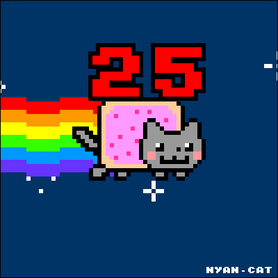

<a name="readme-top"></a>

<div align="center"> 
  
  <br/>

  <h3><b>Welcome to the Decode Morse Code Project :)</b></h3>

</div>


# 📗 Table of Contents

- [📖 About the Project](#about-project)
  - [🛠 Built With](#built-with)
    - [Tech Stack](#tech-stack)
    - [Key Features](#key-features)
  - [🚀 Live Demo](#live-demo)
- [💻 Getting Started](#getting-started)
  - [Prerequisites](#prerequisites)
  - [Setup](#setup)
  - [Install](#install)
  - [Usage](#usage)
  - [Run tests](#run-tests)
  - [Deployment](#deployment)
- [👥 Authors](#authors)
- [🔭 Future Features](#future-features)
- [🤝 Contributing](#contributing)
- [⭐️ Show your support](#support)
- [🙏 Acknowledgements](#acknowledgements)
- [📝 License](#license)


# 📖 Decode Morse Code <a name="about-project"></a>

**Decode Morse Code** is a Ruby project that allows users to convert Morse code to text.

## 🛠 Built With <a name="built-with"></a>

### Tech Stack <a name="tech-stack"></a>

<details>
  <summary>Language</summary>
  <ul>
    <li>Ruby</li>
  </ul>
</details>

<details>
  <summary>Code Analysis</summary>
  <ul>
    <li>Rubocop</li>
  </ul>
</details>


### Key Features <a name="key-features"></a>

<!-- > Describe between 1-3 key features of the application. -->

- **[Morse Code to Text Conversion]** - Decode Morse code and convert it to readable text.
- **[Ruby]** - Utilizes the Ruby programming language for the implementation.
- **[Rubocop]** - Code analysis and linting tool used to ensure code quality.

<p align="right">(<a href="#readme-top">back to top</a>)</p>


## 🚀 Live Demo <a name="live-demo"></a>

This project does not have a live demo available at the moment.

<p align="right">(<a href="#readme-top">back to top</a>)</p>


## 💻 Getting Started <a name="getting-started"></a>


To get a local copy up and running, follow these steps.

### Prerequisites

In order to run this project you need:
- Ruby installed
- A code editor such as Visual Studio Code
- Git


### Setup

Clone this repository to your desired folder:
```bash
git clone https://github.com/benja27/decode-morse-code.git  

### Install

Install this project with:
bundle install


### Usage

To run the project, execute the following command:
ruby index.rb

### Run tests

To run tests, run the following command:
npm run test


### Deployment

You can deploy this project using:
you can use any service avalaible on internet such as:

Render
Heroku

I recomend Render since is easy to use


<p align="right">(<a href="#readme-top">back to top</a>)</p>


## 👥 Authors <a name="authors"></a>

> Mention all of the collaborators of this project.

👤 **Mariano Benjamin**

- GitHub: [@githubhandle](https://github.com/benja27)
- LinkedIn: [LinkedIn](http://www.linkedin.com/in/BenjaMendez2699)

<p align="right">(<a href="#readme-top">back to top</a>)</p>


## 🔭 Future Features <a name="future-features"></a>

- [ ] **[Improve user interface]**
- [ ] **[Improve Ruby code]**
- [ ] **[Implement conexion to a database]**

<p align="right">(<a href="#readme-top">back to top</a>)</p>


## 🤝 Contributing <a name="contributing"></a>

Contributions, issues, and feature requests are welcome!

Feel free to check the [issues page](../../issues/).

<p align="right">(<a href="#readme-top">back to top</a>)</p>


## ⭐️ Show your support <a name="support"></a>

If you like this project please give me star! thanks!

<p align="right">(<a href="#readme-top">back to top</a>)</p>


## 🙏 Acknowledgments <a name="acknowledgements"></a>

I would like to thank microverse for this great coding experience

<p align="right">(<a href="#readme-top">back to top</a>)</p>


<p align="right">(<a href="#readme-top">back to top</a>)</p>


## 📝 License <a name="license"></a>

This project is [MIT](./MIT.md) licensed.

<p align="right">(<a href="#readme-top">back to top</a>)</p>
